# Screenshot Of The IntelliJ
[Home](README.md)

## IntelliJ

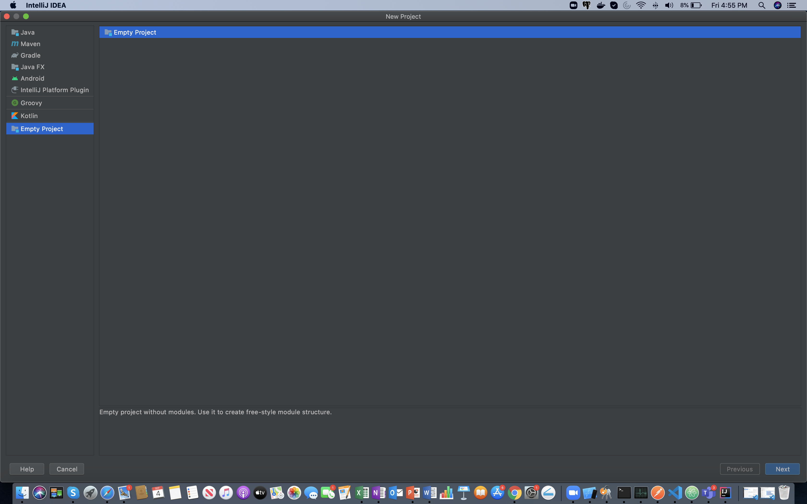

## Android Studio

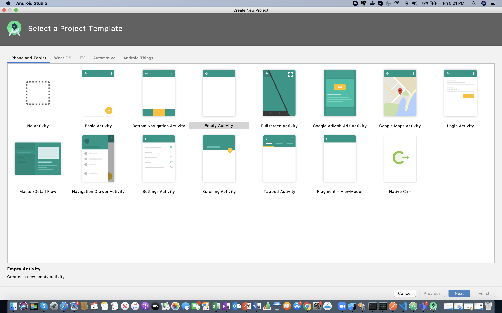

## Terminal Set up

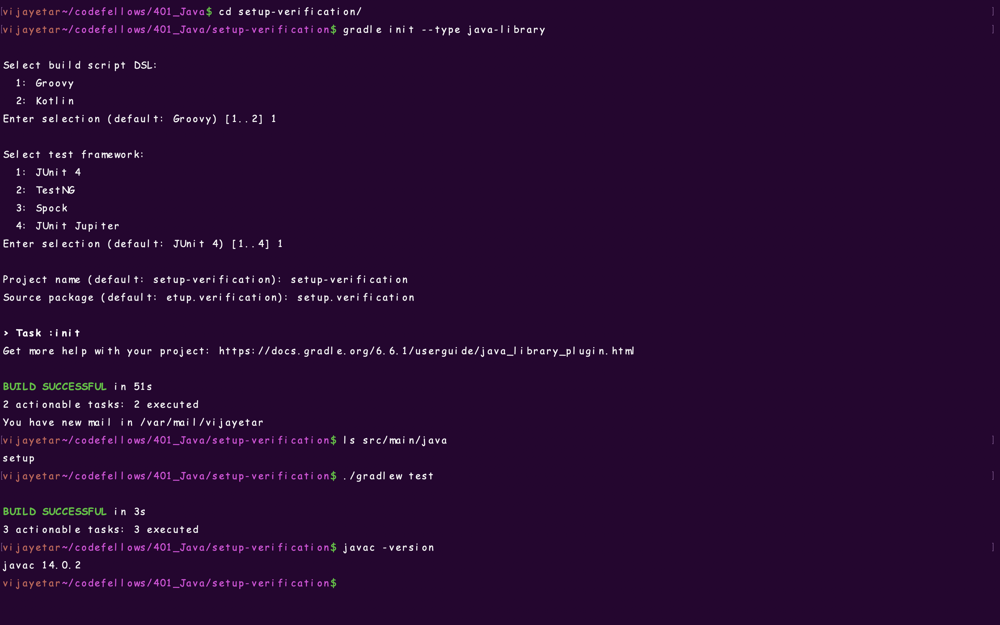

## Gradlew run

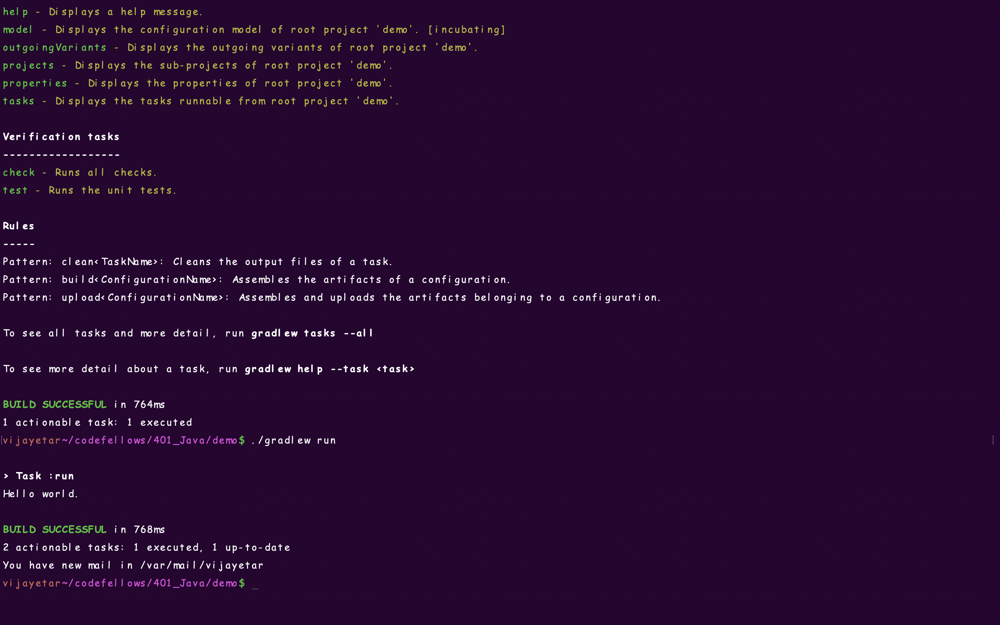

## Exercises  
### Hello World  
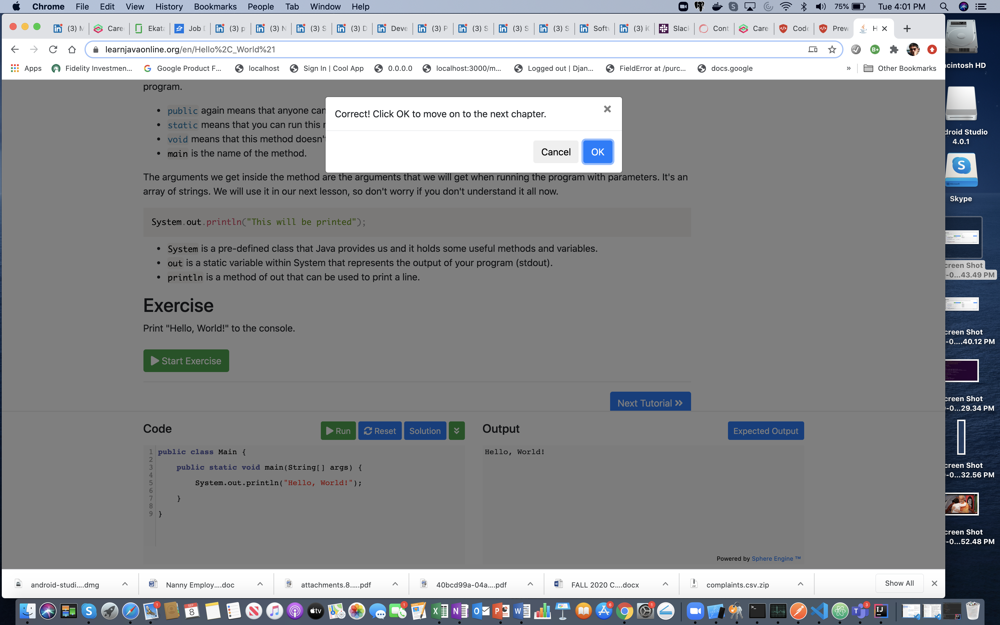

### Variables and Types  
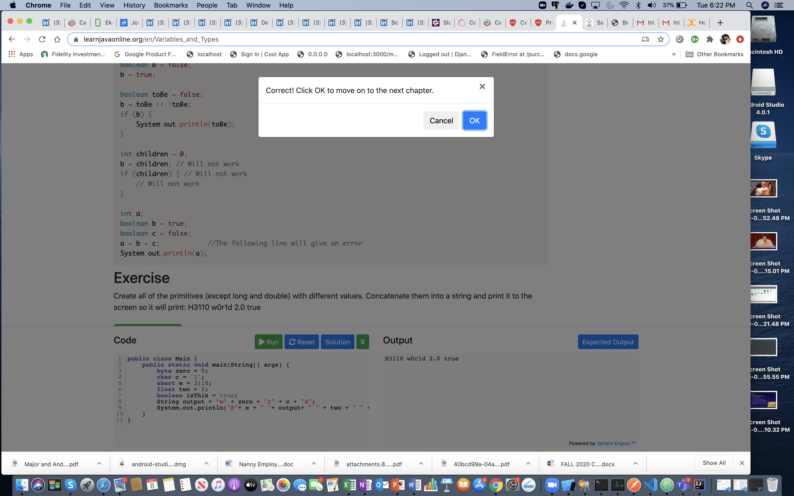

### Conditionals  
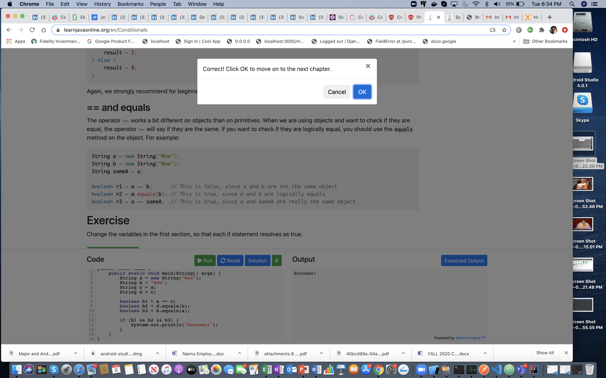

### Arrays  
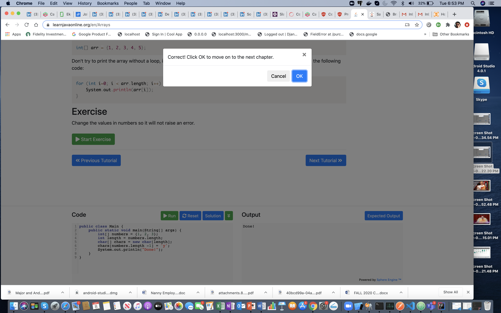  

### Loops  
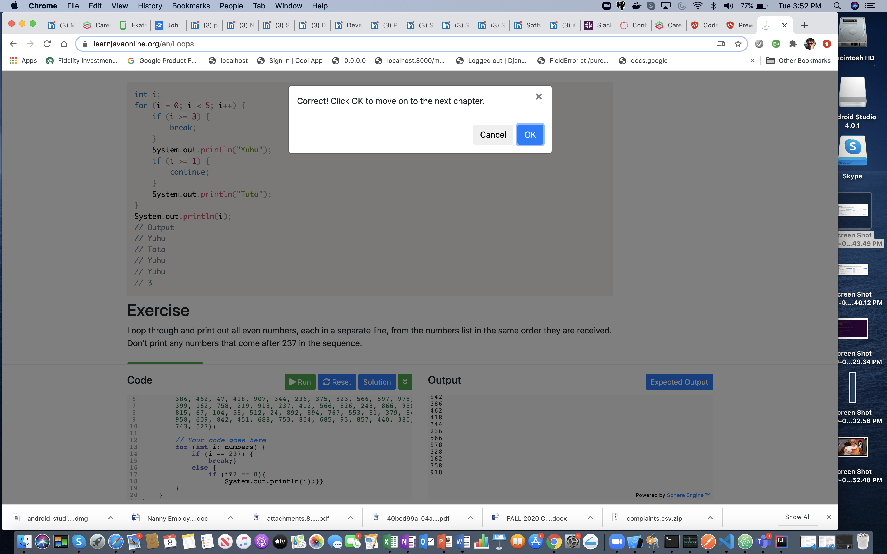

### Functions  
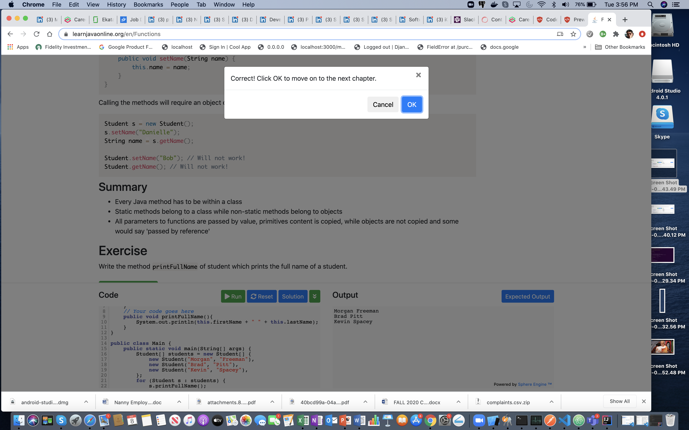   
### Objects   
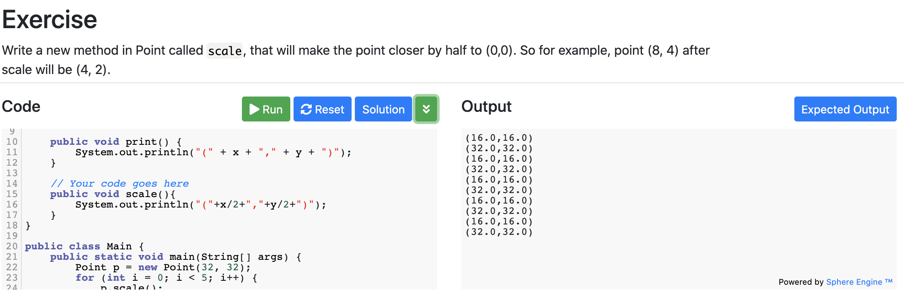  